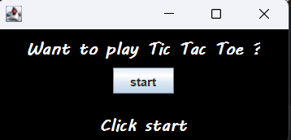
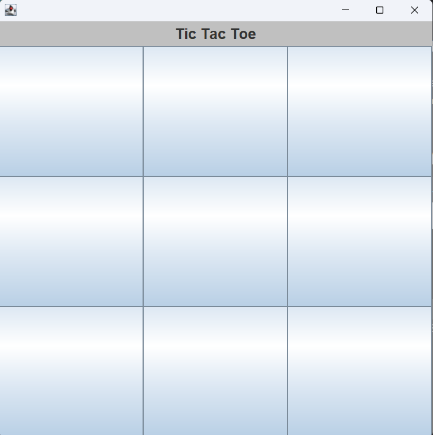
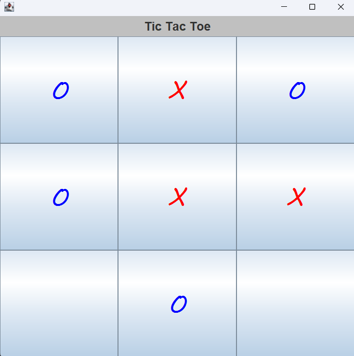
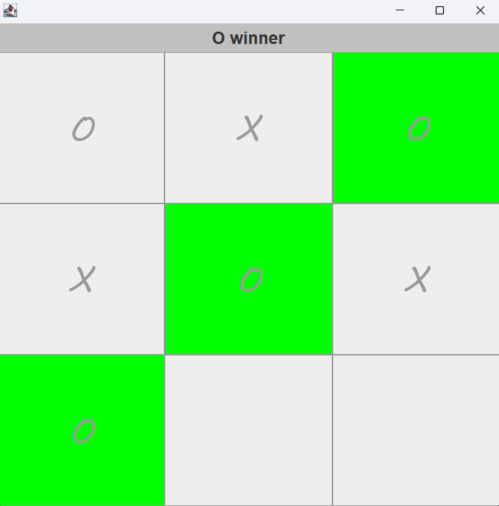

# Tic Tac Toe

This is a simple Tic Tac Toe game programmed in Java. The game allows the 
user to play against another user

## How to play ??

> First, click start to launch the game
> 
>

> click to any empty field
> 

> One player is "O" and the other player is "X"
> 
> Player with "O" starts first, then player "X"
> 
> 

> If someone has managed to place his markers in a row, this player has won
> 

> and if it's a draw no one has won
> 
> 
>
